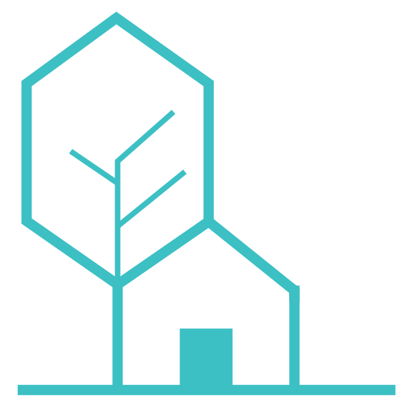
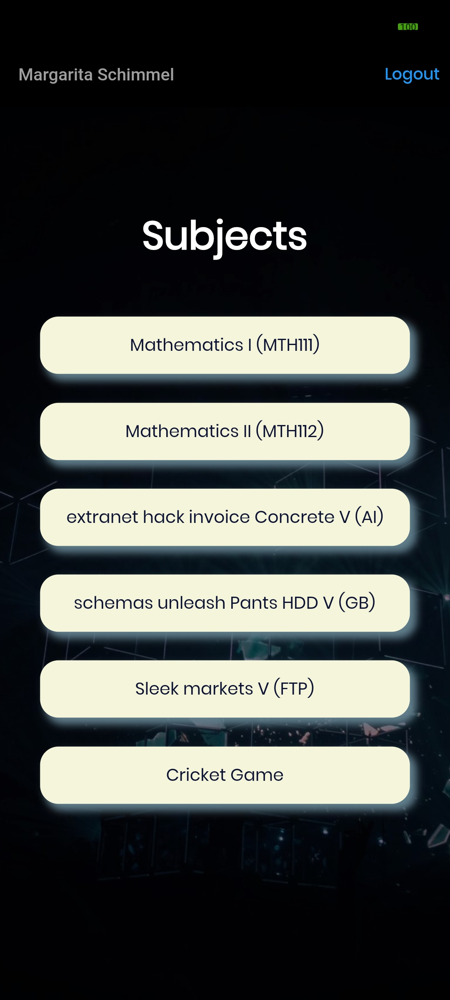
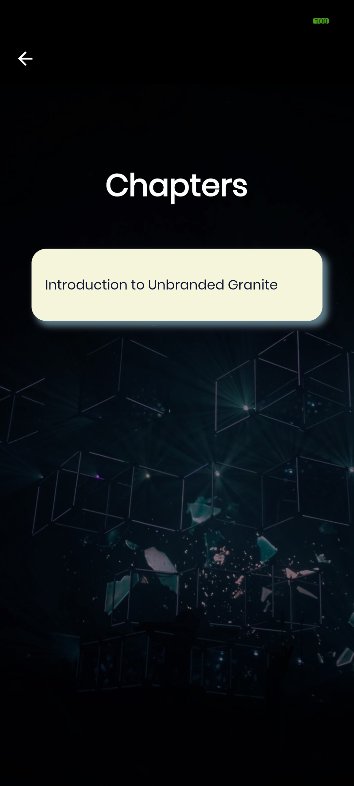
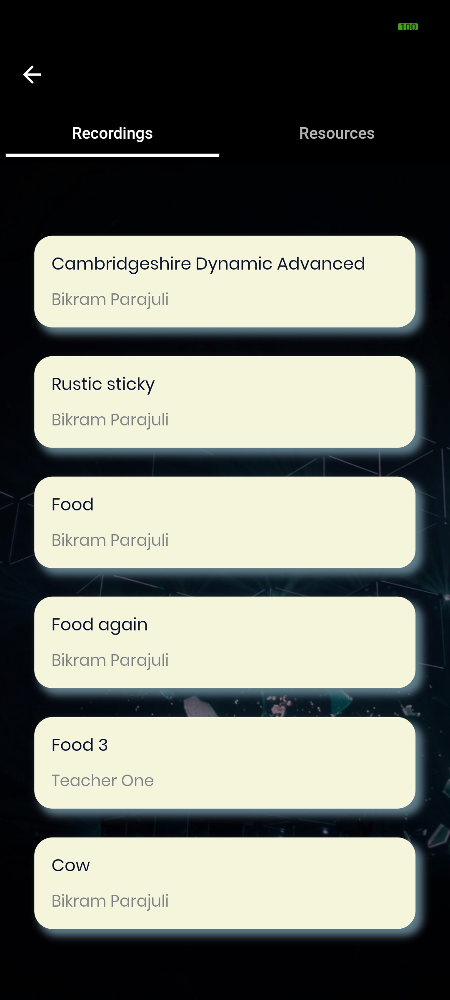
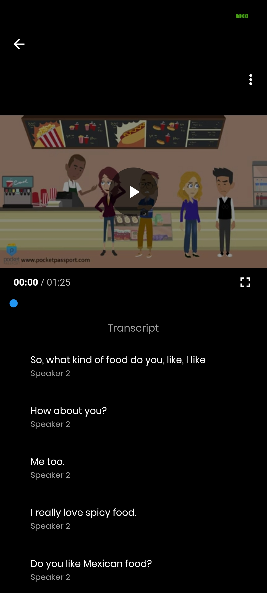
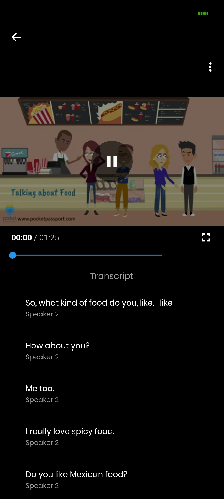
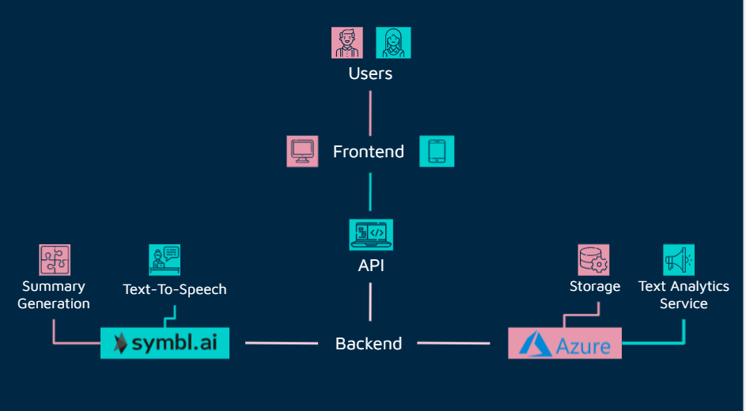

[![Contributors][contributors-shield]][contributors-url]
[![Forks][forks-shield]][forks-url]
[![Stargazers][stars-shield]][stars-url]

<!-- PROJECT LOGO -->
<br />
<p align="center">
  <a href="https://github.com/codekavya/smartschool-mobile">
    
  </a>

  <h3 align="center">Smart School Mobile</h3>

  <p align="center">
    A natural language processing-powered cross-platform service for students of the future.
    <br />
    <a href="#about-the-project"><strong>Explore the readme »</strong></a>
    <br />
    <br />
    <a href="https://codekavya.com">Contact Us</a>
    ·
    <a href="https://github.com/codekavya/smartschool-mobile/issues">Report Bug</a>
    ·
    <a href="https://github.com/codekavya/smartschool-mobile/issues">Request Feature</a>
  </p>
</p>

<!-- TABLE OF CONTENTS -->
<details open="open">
  <summary>Table of Contents</summary>
  <ol>
    <li>
      <a href="#about-the-project">About The Project</a>
      <ul>
        <li><a href="#built-with">Built With</a></li>
      </ul>
    </li>
    <li>
      <a href="#getting-started">Getting Started</a>
      <ul>
        <li><a href="#prerequisites">Prerequisites</a></li>
        <li><a href="#installation">Installation</a></li>
      </ul>
    </li>
    <li><a href="#contact">Contact</a></li>
  </ol>
</details>

# About the project

<p float="left">
  
  
  
</p>
<p float="left">
  
  
  
</p>


A natural language processing-powered cross-platform service for students of the future.

These repository is accompanied by the following repositories.
# Peer Repositories

<a href="https://github.com/codekavya/smartschool-frontend">
  <!-- Change the `github-readme-stats.anuraghazra1.vercel.app` to `github-readme-stats.vercel.app`  -->
  
</a>    
<a href="https://github.com/codekavya/smartschool-backend">
  <!-- Change the `github-readme-stats.anuraghazra1.vercel.app` to `github-readme-stats.vercel.app`  -->
  
</a>

## Built With

* [Flutter](https://flutter.dev/)

This is the list of technologies that we are using for the backend of the project.

* [Node js](https://nodejs.org/en/)
* [Express](http://expressjs.com/)
* [MongoDb](https://www.mongodb.com/)
* [Mongoose](https://mongoosejs.com/)
* [JWT](https://jwt.io/)
* [Azure Blob Storage](https://azure.microsoft.com/en-us/services/storage/blobs/)
* [Azure Text Analytics](https://azure.microsoft.com/en-us/services/cognitive-services/text-analytics/)
* [Symbl Ai](https://symbl.ai/)


# Structure



# Getting Started
## Prerequisites
You need to have the project backend running in your local machine to run this project. Follow the [Guide](https://github.com/codekavya/smartschool-backend) here

## Installation

**Clone the repository to your device.**
```bash
git clone https://github.com/codekavya/smartschool-mobile.git
```
**Change your current directory into the project**
```bash
cd smartschool-mobile
```
**Install dependencies**
```bash
pub get
```

**Run the project**
```bash
flutter run
```

<!-- CONTACT -->
## Contact

Codekavya - [@codekavya](https://twitter.com/codekavya) - contact@codekavya.com


[contributors-shield]: https://img.shields.io/github/forks/codekavya/smartschool-mobile?style=for-the-badge
[contributors-url]: https://github.com/codekavya/smartschool-mobile/graphs/contributors
[forks-shield]: https://img.shields.io/github/forks/codekavya/smartschool-mobile?style=for-the-badge
[forks-url]: https://github.com/codekavya/smartschool-mobile/network/members
[stars-shield]: https://img.shields.io/github/stars/codekavya/smartschool-mobile?style=for-the-badge
[stars-url]: https://github.com/codekavya/smartschool-mobile/stargazers
